

# Convolutiona Neural Network - CIFAR 10

Authors: 

- **Jahir Gilberth Medina Lopez**
    * *USP #* **10659682**
- **Jeffry Erwin Murrugarra Llerena**
    * *USP #* **10655837** 

## Architecture

### Description

| Id Layer  | Neurons/Size  | Filter Size   | Activation    | Dropout   | Max-Pooling   |    Layer Type     |
|:--------: |:------------: |:-----------:  |:----------:   |:-------:  |:-----------:  |:----------------: |
|     0     |    32x32x3    |      -        |      -        |    -      |      -        |    Input Layer    |
|     1     |      36       |     3x3       |    ReLU       |   0.0     |      -        | 2D Convolutional  |
|     2     |      36       |     2x2       |    SeLU       |   0.2     |      -        | 2D Convolutional  |
|     3     |       -       |      -        |      -        |    -      |     2x2       |      Pooling      |
|     4     |      48       |     2x2       |    SeLU       |   0.0     |      -        | 2D Convolutional  |
|     5     |      48       |     4x4       |    ReLU       |   0.3     |      -        | 2D Convolutional  |
|     6     |       -       |      -        |      -        |    -      |     2x2       |      Pooling      |
|     7     |      64       |     3x3       |    ReLU       |   0.0     |      -        | 2D Convolutional  |
|     8     |      64       |     3x3       |    SeLU       |   0.3     |      -        | 2D Convolutional  |
|     9     |       -       |      -        |      -        |    -      |     2x2       |      Pooling      |
|    10     |      500      |      -        |    SeLU       |   0.8     |      -        |  Fully Connected  |
|    11     |      300      |      -        |    ReLU       |   0.4     |      -        |  Fully Connected  |
|    12     |      10       |      -        |   SoftMax     |   0.0     |      -        |   Output Layer    |

> CNN Optmizer : **Ada Delta**
> 
> Loss Function : **Categorical Crossentropy**
> 
> Metrics : **Accuracy Default by Loss Function : Categorical**

### Why This Architecture?

#### SeLU
SeLU stands for ***scaled exponential linear units*** : 

where for standard scaled inputs (mean 0, standar deviation 1), the values are α=1.6732~, λ=1.0507~.

#### SoftMax

## Data

### Batched Data (Binaries for Python)

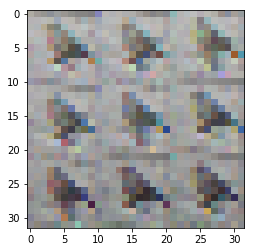

### Keras CIFAR 10

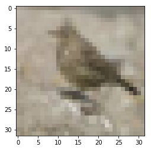

## Training

### Training Behavior Plot

#### First Training

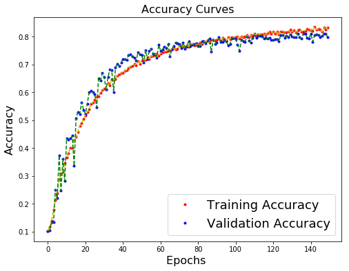

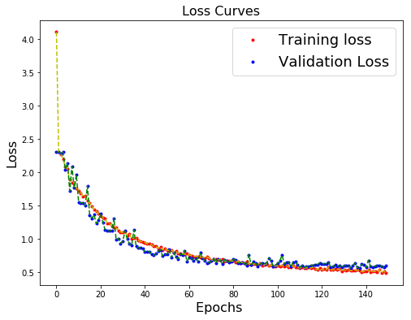

#### 5 epoch Post Training

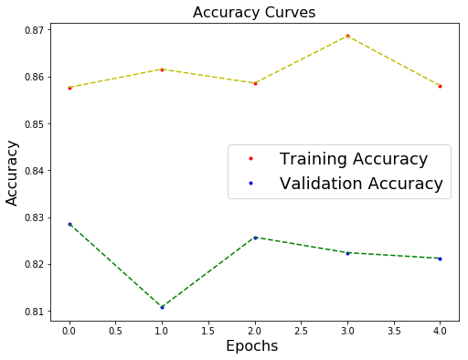

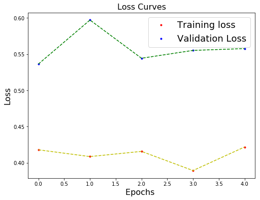

#### 50 epoch Post Training

#### Accuracy

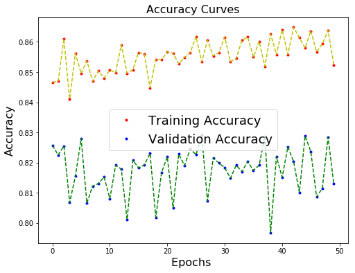

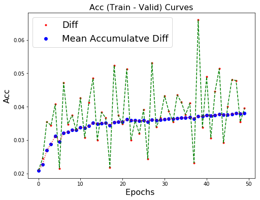

#### Losseles

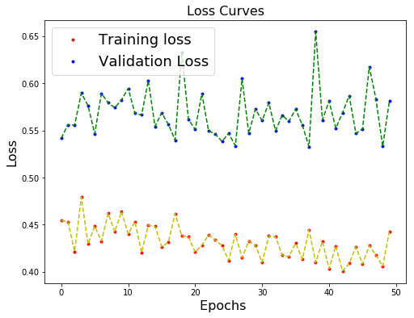

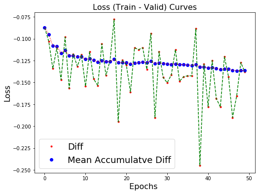

## Conclusion

## Others Architectures

### v1

This code was obtained [online](https://www.learnopencv.com/image-classification-using-convolutional-neural-networks-in-keras/), and used as dummy for learning (How to properly use Keras), more even, this kind of architecture uses a ***RMS Prop*** optmization, how works better with *Recurrent Neural Networks* and *insuficiente* batch size.

### Desing

| Id Layer  | Neurons/Size  | Filter Size   | Activation    | Dropout   | Max-Pooling   |    Layer Type     |
|:--------: |:------------: |:-----------:  |:----------:   |:-------:  |:-----------:  |:----------------: |
|     0     |    32x32x3    |      -        |      -        |    -      |      -        |    Input Layer    |
|     1     |      32       |     3x3       |    ReLU       |   0.0     |      -        | 2D Convolutional  |
|     2     |      32       |     3x3       |    ReLU       |   0.25    |      -        | 2D Convolutional  |
|     3     |       -       |      -        |      -        |    -      |     2x2       |      Pooling      |
|     4     |      64       |     3x3       |    ReLU       |   0.0     |      -        | 2D Convolutional  |
|     5     |      64       |     3x3       |    ReLU       |   0.25    |      -        | 2D Convolutional  |
|     6     |       -       |      -        |      -        |    -      |     2x2       |      Pooling      |
|     7     |      64       |     3x3       |    ReLU       |   0.0     |      -        | 2D Convolutional  |
|     8     |      64       |     3x3       |    ReLU       |   0.25    |      -        | 2D Convolutional  |
|     9     |       -       |      -        |      -        |    -      |     2x2       |      Pooling      |
|    10     |      512      |      -        |    SeLU       |   0.5     |      -        |  Fully Connected  |
|    11     |      10       |      -        |   SoftMax     |   0.0     |      -        |   Output Layer    |

> CNN Optmizer : **RMS prop**
> 
> Loss Function : **Categorical Crossentropy**
> 
> Metrics : **Accuracy Default by Loss Function : Categorical**
>
> Epochs : **50**
> 
> Batch Size : **256**

#### Training Plot

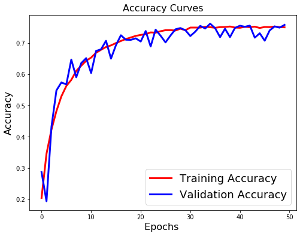

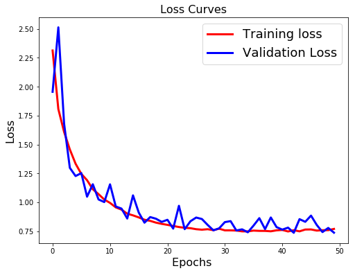

### v2

In this version, was analized the batch size and with more enfasys the number of epochs per train.
The network architectur remaing the same

### Desing

> CNN Optmizer : **RMS prop**
> 
> Loss Function : **Categorical Crossentropy**
> 
> Metrics : **Accuracy Default by Loss Function : Categorical**
>
> Epochs : **100**
> 
> Batch Size : **1000**

#### Training Plot

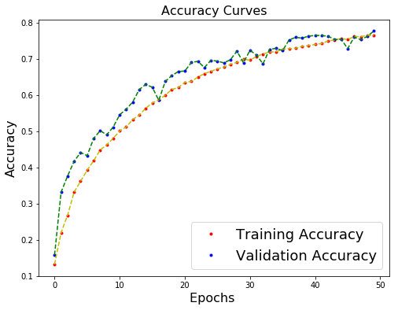

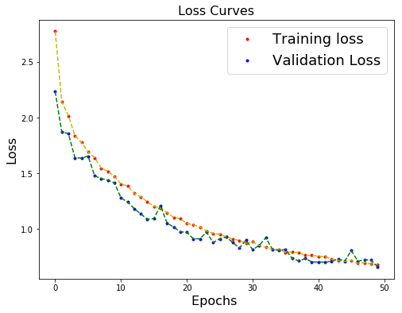

### v3

### Desing

| Id Layer  | Neurons/Size  | Filter Size   |  Activation   | Dropout   | Max-Pooling   |    Layer Type     |
|:--------: |:------------: |:-----------:  |:------------: |:-------:  |:-----------:  |:----------------: |
|     0     |    32x32x3    |      -        |       -       |    -      |      -        |    Input Layer    |
|     1     |      36       |     3x3       | Hard Sigmoid  |   0.0     |      -        | 2D Convolutional  |
|     2     |      48       |     5x5       |     ReLU      |   0.3     |      -        | 2D Convolutional  |
|     3     |       -       |      -        |       -       |    -      |     2x2       |      Pooling      |
|     4     |      64       |     3x3       |  Exponential  |   0.0     |      -        | 2D Convolutional  |
|     5     |      72       |     5x5       |     ReLU      |   0.25    |      -        | 2D Convolutional  |
|     6     |       -       |      -        |       -       |    -      |     2x2       |      Pooling      |
|     7     |      64       |     3x3       |     ReLU      |   0.0     |      -        | 2D Convolutional  |
|     8     |      64       |     3x3       |     Tanh      |   0.4     |      -        | 2D Convolutional  |
|     9     |       -       |      -        |       -       |    -      |     2x2       |      Pooling      |
|    10     |      400      |      -        |     ReLU      |   0.8     |      -        |  Fully Connected  |
|    11     |      200      |      -        |     ReLU      |   0.4     |      -        |  Fully Connected  |
|    12     |      100      |      -        |     Tanh      |   0.3     |      -        |  Fully Connected  |
|    13     |      10       |      -        |    SoftMax    |   0.0     |      -        |   Output Layer    |

> CNN Optmizer : **RMS prop**
> 
> Loss Function : **Categorical Crossentropy**
> 
> Metrics : **Accuracy Default by Loss Function : Categorical**
>
> Epochs : **100**
> 
> Batch Size : **1000**

#### Training Plot

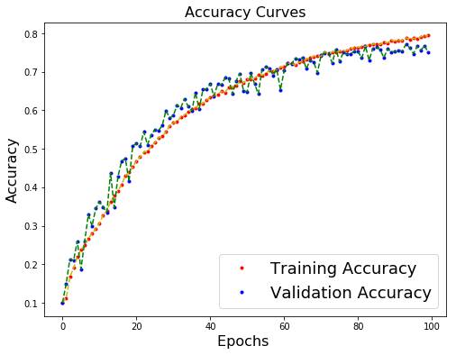

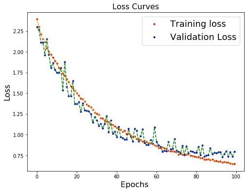

### v4

### Desing

|       | Neurons/Size  | Filter Size   |  Activation   | Dropout   | Max-Pooling   |    Layer Type     |
|:--:   |:------------: |:-----------:  |:------------: |:-------:  |:-----------:  |:----------------: |
|  0    |    32x32x3    |      -        |       -       |    -      |      -        |    Input Layer    |
|  1    |      36       |     3x3       | Hard Sigmoid  |   0.0     |      -        | 2D Convolutional  |
|  2    |      48       |     5x5       |     ReLU      |   0.3     |      -        | 2D Convolutional  |
|  3    |       -       |      -        |       -       |    -      |     2x2       |      Pooling      |
|  4    |      48       |     3x3       |  Exponential  |   0.0     |      -        | 2D Convolutional  |
|  5    |      48       |     5x5       |     ReLU      |   0.25    |      -        | 2D Convolutional  |
|  6    |       -       |      -        |       -       |    -      |     2x2       |      Pooling      |
|  7    |      48       |     3x3       |     ReLU      |   0.0     |      -        | 2D Convolutional  |
|  8    |      64       |     3x3       |     Tanh      |   0.4     |      -        | 2D Convolutional  |
|  9    |       -       |      -        |       -       |    -      |     2x2       |      Pooling      |
| 10    |      400      |      -        |     ReLU      |   0.8     |      -        |  Fully Connected  |
| 11    |      200      |      -        |     ReLU      |   0.4     |      -        |  Fully Connected  |
| 12    |      100      |      -        |     Tanh      |   0.3     |      -        |  Fully Connected  |
| 13    |      10       |      -        |    SoftMax    |   0.0     |      -        |   Output Layer    |

> CNN Optmizer : **RMS prop**
> 
> Loss Function : **Categorical Crossentropy**
> 
> Metrics : **Accuracy Default by Loss Function : Categorical**
>
> Epochs : **500**
> 
> Batch Size : **1000**

#### Training Plot

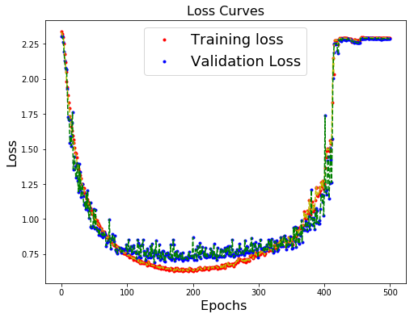