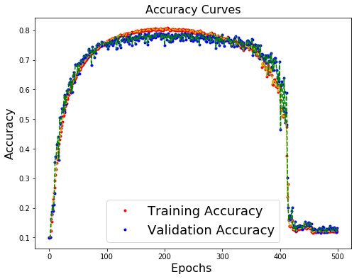

# Convolutional Neural Network - CIFAR 10

Authors: 

- **Jahir Gilberth Medina Lopez**
    * *USP #* **10659682**
- **Jeffry Erwin Murrugarra Llerena**
    * *USP #* **10655837** 

## Note and Important Links

### Note
**Take in consideration this the finaly relatory of a project (formated to also be only).**
### Important Links

- [Relatory Online Version]("https://www.jahirmedina.com/cnn-project2/")

#### Notebook

- [CNN Training Notebook]("https://nbviewer.jupyter.org/github/jahirmedinacs/cnn-project2/blob/master/notebooks/ANN%20-%20CIFAR%2010.ipynb")

- [After Training Demo Notebook]("https://nbviewer.jupyter.org/github/jahirmedinacs/cnn-project2/blob/master/notebooks/main.ipynb")

#### Script

- [CNN Training Script]("https://raw.githubusercontent.com/jahirmedinacs/cnn-project2/master/project-container/cnn.py")

- [After Training Demo Script]("https://raw.githubusercontent.com/jahirmedinacs/cnn-project2/master/project-container/main.py")

## Architecture

### Description

| Id Lyr.  | Lyr. Size  | Fltr. Size   | Activation    | Dropout   | Max-Pool   |    Layer Type     |
|:--------: |:------------: |:-----------:  |:----------:   |:-------:  |:-----------:  |:----------------: |
|     0     |    32x32x3    |      -        |      -        |    -      |      -        |    Input Layer    |
|     1     |      36       |     3x3       |    ReLU       |   0.0     |      -        | Convolutional  |
|     2     |      36       |     2x2       |    SeLU       |   0.2     |      -        | Convolutional  |
|     3     |       -       |      -        |      -        |    -      |     2x2       |      Pooling      |
|     4     |      48       |     2x2       |    SeLU       |   0.0     |      -        | Convolutional  |
|     5     |      48       |     4x4       |    ReLU       |   0.3     |      -        | Convolutional  |
|     6     |       -       |      -        |      -        |    -      |     2x2       |      Pooling      |
|     7     |      64       |     3x3       |    ReLU       |   0.0     |      -        | Convolutional  |
|     8     |      64       |     3x3       |    SeLU       |   0.3     |      -        | Convolutional  |
|     9     |       -       |      -        |      -        |    -      |     2x2       |      Pooling      |
|    10     |      500      |      -        |    SeLU       |   0.8     |      -        |  Fully Conn.  |
|    11     |      300      |      -        |    ReLU       |   0.4     |      -        |  Fully Conn.  |
|    12     |      10       |      -        |   SoftMax     |   0.0     |      -        |   Output Layer    |

> CNN Optmizer : **Ada Delta**
> 
> Loss Function : **Categorical Crossentropy**
> 
> Metrics : **Accuracy Default by Loss Function : Categorical**

### Activations Functions Formulas

#### SeLU
SeLU stands for ***scaled exponential linear units*** : 

where for standard scaled inputs (mean 0, standard deviation 1), the values are α=1.6732~, λ=1.0507~.

#### SoftMax

## Data

### Batched Data (Binaries for Python)

### Keras CIFAR 10

## Training

### Training Evolution Plot

#### First Training

#### 5 Epoch Post Training

#### 50 Epoch Post Training

##### Accuracy

##### Losses

## Conclusion

## Others Architectures

### v1

This code was obtained [online](https://www.learnopencv.com/image-classification-using-convolutional-neural-networks-in-keras/), and used as a dummy for learning (How to properly use Keras), more even, this kind of architecture uses a ***RMS Prop*** optimization, how works better with *Recurrent Neural Networks* and *insufficient* batch size.

#### Desing

| Id Lyr.  | Lyr. Size  | Fltr. Size   | Activation    | Dropout   | Max-Pool   |    Layer Type     |
|:--------: |:------------: |:-----------:  |:----------:   |:-------:  |:-----------:  |:----------------: |
|     0     |    32x32x3    |      -        |      -        |    -      |      -        |    Input Layer    |
|     1     |      32       |     3x3       |    ReLU       |   0.0     |      -        | Convolutional  |
|     2     |      32       |     3x3       |    ReLU       |   0.25    |      -        | Convolutional  |
|     3     |       -       |      -        |      -        |    -      |     2x2       |      Pooling      |
|     4     |      64       |     3x3       |    ReLU       |   0.0     |      -        | Convolutional  |
|     5     |      64       |     3x3       |    ReLU       |   0.25    |      -        | Convolutional  |
|     6     |       -       |      -        |      -        |    -      |     2x2       |      Pooling      |
|     7     |      64       |     3x3       |    ReLU       |   0.0     |      -        | Convolutional  |
|     8     |      64       |     3x3       |    ReLU       |   0.25    |      -        | Convolutional  |
|     9     |       -       |      -        |      -        |    -      |     2x2       |      Pooling      |
|    10     |      512      |      -        |    SeLU       |   0.5     |      -        |  Fully Conn.  |
|    11     |      10       |      -        |   SoftMax     |   0.0     |      -        |   Output Layer    |

> CNN Optmizer : **RMS prop**
> 
> Loss Function : **Categorical Crossentropy**
> 
> Metrics : **Accuracy Default by Loss Function : Categorical**
>
> Epochs : **50**
> 
> Batch Size : **256**

#### Training Plot

### v2

In this version, was analyzed the batch size and with higher emphasis the number of epochs per train.
The network architecture remain the same.

#### Desing

> CNN Optmizer : **RMS prop**
> 
> Loss Function : **Categorical Crossentropy**
> 
> Metrics : **Accuracy Default by Loss Function : Categorical**
>
> Epochs : **100**
> 
> Batch Size : **1000**

#### Training Plot

### v3

The idea behind modifications on this version was to find the best (more fastest) architecture. To archive that, we were continuously changing some ***layer activation functions, layer size, and dropout probability***, the architecture below shows the last changed perform over parameters.

#### Desing

| Id Lyr.  | Lyr. Size  | Fltr. Size   |  Activation   | Dropout   | Max-Pool   |    Layer Type     |
|:--------: |:------------: |:-----------:  |:------------: |:-------:  |:-----------:  |:----------------: |
|     0     |    32x32x3    |      -        |       -       |    -      |      -        |    Input Layer    |
|     1     |      36       |     3x3       | Hard Sigmoid  |   0.0     |      -        | Convolutional  |
|     2     |      48       |     5x5       |     ReLU      |   0.3     |      -        | Convolutional  |
|     3     |       -       |      -        |       -       |    -      |     2x2       |      Pooling      |
|     4     |      64       |     3x3       |  Exponential  |   0.0     |      -        | Convolutional  |
|     5     |      72       |     5x5       |     ReLU      |   0.25    |      -        | Convolutional  |
|     6     |       -       |      -        |       -       |    -      |     2x2       |      Pooling      |
|     7     |      64       |     3x3       |     ReLU      |   0.0     |      -        | Convolutional  |
|     8     |      64       |     3x3       |     Tanh      |   0.4     |      -        | Convolutional  |
|     9     |       -       |      -        |       -       |    -      |     2x2       |      Pooling      |
|    10     |      400      |      -        |     ReLU      |   0.8     |      -        |  Fully Conn.  |
|    11     |      200      |      -        |     ReLU      |   0.4     |      -        |  Fully Conn.  |
|    12     |      100      |      -        |     Tanh      |   0.3     |      -        |  Fully Conn.  |
|    13     |      10       |      -        |    SoftMax    |   0.0     |      -        |   Output Layer    |

> CNN Optmizer : **RMS prop**
> 
> Loss Function : **Categorical Crossentropy**
> 
> Metrics : **Accuracy Default by Loss Function : Categorical**
>
> Epochs : **100**
> 
> Batch Size : **1000**

#### Training Plot

### v4

Using the same ***activation functions at the same layers*** we try to improve the accuracy and reduce losses; to arrive at our objective, we use a more *smooth* variation in the layers size, and increasing the number of ***epochs***.

One valuable thing learned in this variant was more about control instead of network architecture design; even increasing significantly the number of epochs, the training evolution goes from good to **worse**. Like can be see in the plot below, when the minimum was archived the ***CNN*** continues trying to perform better, then, and because we were using some non linear activation functions, the accuracy goes to a very low value following the path of our architecture in his way to *" the global minimum"* but in the wrong direction. ***In few words, using 500 epochs, we force the net to goes from a maximum to minimum and later again to the maximum (the gradient takes the wrong direction)***

#### Desing

| Id Lyr.  | Lyr. Size  | Fltr. Size   |  Activation   | Dropout   | Max-Pool   |    Layer Type     |
|:--:   |:------------: |:-----------:  |:------------: |:-------:  |:-----------:  |:----------------: |
|  0    |    32x32x3    |      -        |       -       |    -      |      -        |    Input Layer    |
|  1    |      36       |     3x3       | Hard Sigmoid  |   0.0     |      -        | Convolutional  |
|  2    |      48       |     5x5       |     ReLU      |   0.3     |      -        | Convolutional  |
|  3    |       -       |      -        |       -       |    -      |     2x2       |      Pooling      |
|  4    |      48       |     3x3       |  Exponential  |   0.0     |      -        | Convolutional  |
|  5    |      48       |     5x5       |     ReLU      |   0.25    |      -        | Convolutional  |
|  6    |       -       |      -        |       -       |    -      |     2x2       |      Pooling      |
|  7    |      48       |     3x3       |     ReLU      |   0.0     |      -        | Convolutional  |
|  8    |      64       |     3x3       |     Tanh      |   0.4     |      -        | Convolutional  |
|  9    |       -       |      -        |       -       |    -      |     2x2       |      Pooling      |
| 10    |      400      |      -        |     ReLU      |   0.8     |      -        |  Fully Conn.  |
| 11    |      200      |      -        |     ReLU      |   0.4     |      -        |  Fully Conn.  |
| 12    |      100      |      -        |     Tanh      |   0.3     |      -        |  Fully Conn.  |
| 13    |      10       |      -        |    SoftMax    |   0.0     |      -        |   Output Layer    |

> CNN Optmizer : **RMS prop**
> 
> Loss Function : **Categorical Crossentropy**
> 
> Metrics : **Accuracy Default by Loss Function : Categorical**
>
> Epochs : **500**
> 
> Batch Size : **1000**

#### Training Plot

